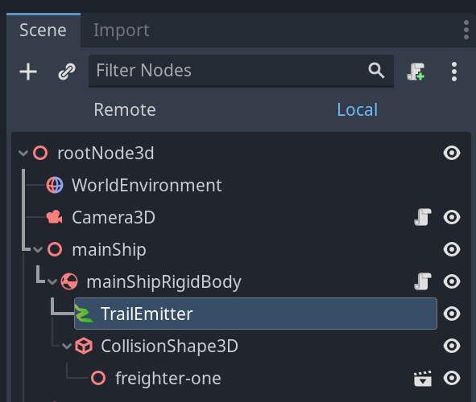
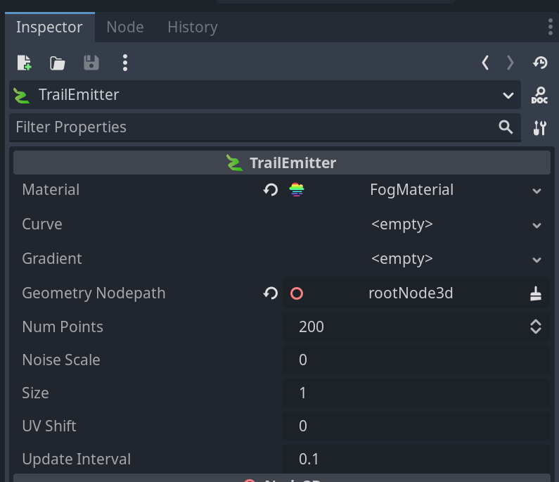
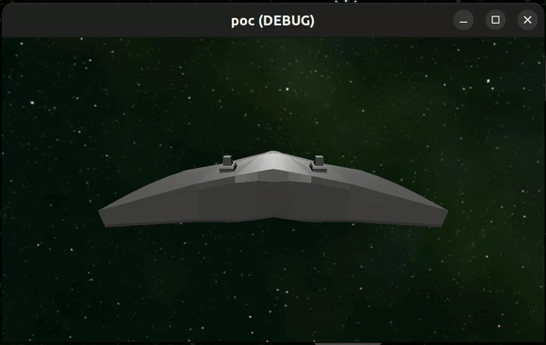

TrailMesh allows you to add 3D trails via an emitter (TrailEmitter), have the shape defined by a curve and colored with a gradient.

Used to implement continuous trails, where an emitter is attached to a physics body which leaves a trail behind when it is moved (for example missile or airplane trails).

Caveats:
  - Does not yet work in editor
  - Visibility is a bit buggy
  - Editor missing UI hints

|  |  |
|-|-|

## Getting Started

1. Add the trail emitter as a child of the object. This could be a ship, a character, a sword, or a projectile.

2. In the inspector, set the `GeometryNodepath` to some parent of the object. Usually, this will be your root node for the scene.

3. Move the object during

Setup implementation from: <https://github.com/nathanfranke/gdextension>
